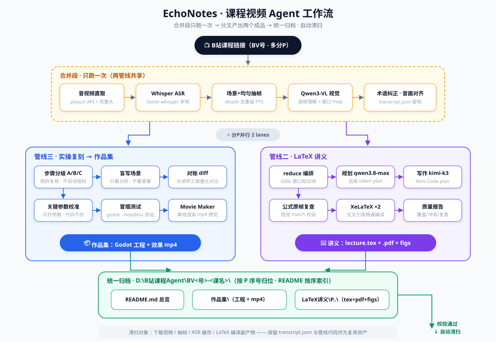
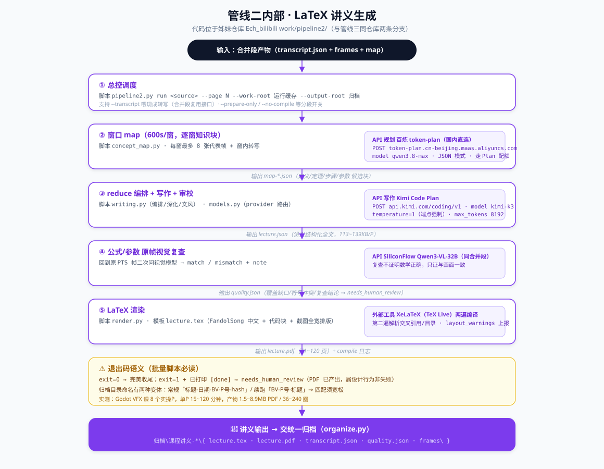
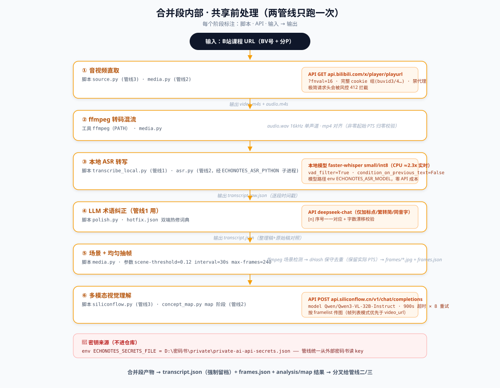

# Ech_lecture · 管线二：课程视频 → LaTeX 讲义

> 输入 B 站课程分P，输出可查证、可打印的 LaTeX 讲义（tex + pdf + 引用截图）。

拾音笺视频观看 agent 三管线之二（姊妹仓库：[Ech_bilibili](https://github.com/WZAwza050801/Ech_bilibili) 读书笔记 · [Ech_practice](https://github.com/WZAwza050801/Ech_practice) 复刻作品集）。



## 环境准备（3 步）

### 1. 系统要求

| 项目 | 版本要求 | 用途 | 缺失后果 |
|---|---|---|---|
| Python | >= 3.10 | 全部脚本 | 无法运行 |
| ffmpeg | 任意近期版本 | 抽音频 / 抽帧 / 转码 | ASR 与抽帧直接失败 |
| XeLaTeX | TeX Live 2023+ / MiKTeX | 把 tex 渲染成 PDF | 只有 tex，没有 pdf |
| 中文字体 | 思源/宋体等 CJK 字体 | 讲义中文正常显示 | PDF 中文变方块或回退字体 |

### 2. 安装依赖

```bash
python -m venv .venv
# Linux/macOS: source .venv/bin/activate
# Windows:     .venv\Scripts\activate

pip install -r requirements.txt          # 核心依赖
pip install -r requirements-asr.txt      # 可选：本地语音转写（建议独立虚拟环境）
```

懒得手动敲？一键脚本把「建环境 + 装依赖 + 自检」一次做完：

```bash
bash scripts/setup.sh          # Linux / macOS
.\scripts\setup.ps1           # Windows PowerShell
# 需要本地语音转写就加参数：--asr / -Asr
```

> 依赖刻意做薄：管线主体只用标准库 + 一两个轻量包；`faster-whisper` 会拖入
> ctranslate2 等重依赖，因此单独放 `requirements-asr.txt`，装到独立 venv 后用
> `ECHONOTES_ASR_PYTHON` 指过去，避免与主线环境互相污染。

### 3. 自检（**跑管线前先跑它**）

```bash
python scripts/check_env.py
```

逐项打印 `[ OK ] / [WARN] / [FAIL]`，缺什么、去哪装、装完怎么验证一次说清；
有必需项缺失时退出码为 1。`--ci` 只校验 Python 与 pip 依赖（给 CI 用）。

### 密钥

复制 `.env.example` 为 `.env` 后填写（`.env` 已被 `.gitignore` 拦截，永不入库）。
每个 Key 用在哪、为什么选这个模型、去哪申请，见 [docs/API_SETUP.md](docs/API_SETUP.md)。
Ech_lecture 的必需 Key：**SILICONFLOW_API_KEY**。

### 常见故障速查

| 症状 | 原因 | 解决 |
|---|---|---|
| PDF 中文乱码 / 字体回退 | TeX 环境缺 CJK 字体 | 装 TeX Live 完整版或指定可用中文字体 |
| 视觉阶段报超时或 401 | Key 未设置或额度用尽 | 重设 SILICONFLOW_API_KEY，脚本内置 900s 超时 × 8 次重试 |
| 退出码 1 但 PDF 已生成 | needs_human_review 的设计行为 | 检查正文末尾的待人工复核标记 |
| xelatex 编译失败 | tex 语法或包缺失 | 看同目录 .log，或 --prepare-only 只准备不调 API |

### 跑起来

```bash
python pipeline2.py run <B站课程链接> --page N
```

## 快速开始

```bash
pipeline2.py run <B站视频链接> --page N
# 可选：--transcript <现成转写json> 跳过 ASR · --prepare-only 只准备不调 API
```

一键环境脚本示例见主仓库分支文档；密钥通过 `ECHONOTES_SECRETS_FILE` 指向外部密码书，仓库不含任何密钥。

## 生成链路

**直取 → ASR → 抽帧 → 视觉 map → 写作 → 复查 → XeLaTeX**（共享前处理只跑一次）



| 阶段 | 实现 | API / 工具 |
|---|---|---|
| 音视频直取 | playurl API + 完整浏览器头 | api.bilibili.com（防 412） |
| 本地转写 | faster-whisper small/int8 | 本地模型，零成本 |
| 场景+均匀抽帧 | ffmpeg + dHash 去重 | 保留真实 PTS |
| 窗口 map | 每窗 ≤8 帧 + 窗内转写 | 百炼 qwen3.8-max（Plan 配额） |
| 写作/审校 | reduce 编排 | Kimi kimi-k3（Code Plan 配额） |
| 公式原帧复查 | 回原 PTS 二次问视觉 | SiliconFlow Qwen3-VL-32B |
| LaTeX 渲染 | 两遍 XeLaTeX（交叉引用） | TeX Live |

## 产物结构

```
归档\课程讲义-<标题>-<日期>-BV-P<号>-<hash>\
├── lecture.tex / lecture.pdf   # 成品（Godot VFX 课实测 1.5~8.9MB / 36~240 图）
├── transcript.json             # 带时间戳转写（供下游复用）
├── quality.json                # 质量报告（覆盖缺口/符号冲突/复查结论）
└── frames\                     # 抽帧证据
```

**退出码语义**：`exit=0` 完美收尾；`exit=1` 且已打印 `[done]` = `needs_human_review`
（PDF 已产出，属设计行为非失败）。

## 已验收课程

- 李群李代数（从机器人应用的角度）P1
- 机器人学：运动学与动力学（Kevin Wood 中文配音）P2
- Godot 游戏特效｜入门至进阶实战课 8 个实操P（2026-09 批量，2 lane 并行 6 小时收官）

## 合并-分叉架构

本项目与读书笔记、复刻作品集两条管线共享同一前处理合并段（只跑一次）：



## API 配置

本仓库用到哪些 Key、为什么选这些模型、在哪申请、怎么自检——见 [docs/API_SETUP.md](docs/API_SETUP.md)。密钥永不入库。